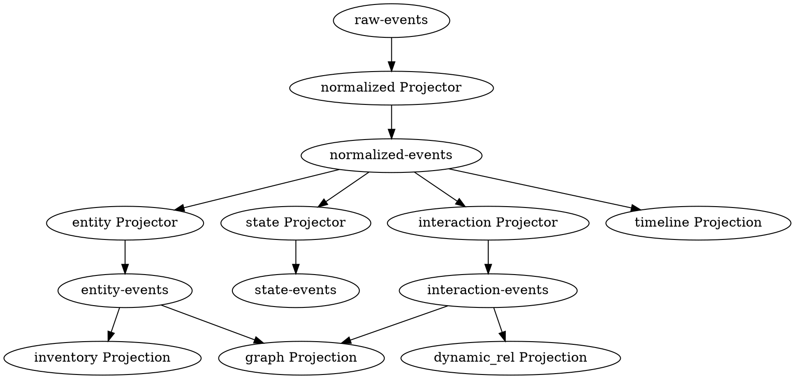

# Logoscope Data Architecture v1 — Event-driven Observability Platform

> **Event Sourcing + Projection + Workflow — 只有 Raw Event 是真正的 Source of Truth。**
> Normalized Event 是从 Raw Event 产生的第一层 Projection，可以重新生成。
>
> 定义从 Raw Log → Raw Event Store → Event Bus (raw-events) → Semantic Engine → NormalizedEvent → Multi-topic Event Bus → Projection Layer → Context Builder → Inference → Topology → Workflow → Action 的完整闭环。

**Status:** Draft v7.1
**Date:** 2026-07-01
**Authors:** croner01, Claude

---

## 1. Problem

### 1.1 当前架构的系统性瓶颈

v6 引入了 Event Bus 和 Property Graph，v7 引入了 Event Sourcing 和 Projection，但仍有根本性问题：

**① Normalized Event 不是真正的 Source of Truth。**
文档说"Event 是唯一 Source of Truth"，但 NormalizedEvent 已经是 Semantic Engine 解析后的结果。如果两年后 Semantic Engine 升级（例如终于能区分 PCI allocation 和 PCI NUMA affinity），没有 raw log 就无法重新解析。Raw Log 一旦接入时丢弃，永远无法恢复。

**② Knowledge Layer 仍然是 mutable database，不是 Projection。**
Entity Builder 直接写入 Neo4j——如果 Knowledge Layer 损坏，无法从 Event Stream 恢复。违反 Event Sourcing 原则。

**③ Graph Builder 保存了不属于它的状态。**
Graph 从 state-events 写入 Neo4j `status=ACTIVE`，但 State Projection（Redis TTL）过期后，Neo4j 的状态不会被清除。Graph 与事实永久不一致。

**④ 没有 Context Snapshot。**
AI 推理或 Workflow 执行可能持续数十秒，期间 Projection 可能变化。AI 前后看到不同数据，产生不一致的结论。

**⑤ 没有 Projection 依赖管理。**
重建多个 Projection 时，依赖顺序靠人工确定。复杂场景下容易出错。

**⑥ 没有 Command/Event 分离。**
Workflow Engine 使用 `workflow-events` 既存命令又存事件。命令（"重启 VM"）是意图，事件（"VM 已重启"）是事实，应分开。

**⑦ 平台对自身不可观测。**
平台自身的事件（Projection 重建、Inference 执行、Workflow 失败）不进入 Event Bus。平台是系统的"黑盒"。

### 1.2 v7.1 核心理念

```
只有 Raw Event 是真正的 Source of Truth。
所有存储层都是 Projection（Materialized View）。
Projection 可以损坏、可以删除、可以重建——只要 Raw Event 还在。
```

这意味着：

```
Raw Event Store   = 真正的不可变事实来源（原样保留日志行）
Normalized Event  = 从 Raw Event 产生的第 1 层 Projection
Entity Registry   = 第 2 层 Projection（from normalized-events）
State             = 第 2 层 Projection（from normalized-events, TTL-based）
Property Graph    = 第 3 层 Projection（from entity + interaction events）
Timeline          = 第 2 层 Projection（ClickHouse Materialized View）
DynamicRelationship = 第 3 层 Projection（from interaction events）
Context           = 非持久化视图（组装各 Projection，不存储）
```

### 1.3 v6 → v7 → v7.1 变更

| 维度 | v6 | v7 | v7.1 |
|------|----|----|------|
| **Source of Truth** | Knowledge Layer | Normalized Event | **Raw Event** |
| **Knowledge Layer** | mutable database | Inventory Projection | Inventory Projection（Epoch 化） |
| **State** | Knowledge State Registry | State Projection（独立 Redis，TTL） | State Projection（不变） |
| **Graph** | Graph Builder (ETL) | Graph Projection（versioned） | **Graph Projection（只存拓扑，不存状态）** |
| **Context** | AI 自己拼装 | Context Builder → IncidentContext | **Context Builder + Snapshot** |
| **Event Bus** | 单 topic | Multi-topic（7 topics） | **Multi-topic（10 topics：+raw-events, platform-events, workflow-commands）** |
| **Projection** | 无版本 | version | **Epoch + Dependency Graph** |
| **Builder** | Entity/State/Interaction Builder | Entity/State/Interaction Builder | **→ Projector**（统一命名） |
| **Timeline** | ClickHouse 查询 | Timeline Projection | **ClickHouse Materialized View**（无自定义代码） |
| **Workflow** | 无 | Workflow Engine（架构预留） | **Command/Event 分离** |
| **Inference 输出** | 无结构 | 无结构 | **Finding 统一结构** |
| **DynamicRel** | Cache 实现 | Cache 实现 | **ClickHouse Projection**（支持时间窗口） |
| **平台可观测性** | 无 | 无 | **Platform Events** |
| **重建编排** | 人工 | 人工 | **Dependency Graph → 自动拓扑排序** |

---

## 2. Architecture

### 2.1 整体架构

```
                    Raw Logs / Metrics / Traces / Events
                               |
                               v
                     ┌─────────────────┐
                     │ Raw Event Store  │  ← 真正的 Source of Truth
                     │ (immutable,      │
                     │  append-only)    │
                     └────────┬────────┘
                              |
                              v
                    Event Bus (raw-events)
                              |
                              v
                      Semantic Engine
                              |
                      NormalizedEvent
                              |
                    +---------v----------+
                    |      Event Bus      |
                    |   (Multi-topic)    |
                    +--+--+--+--+--+--+--+
                       |  |  |  |  |  |
              raw     norm entity state graph
              events  events       events
                       |  |  |  |  |  |
                       +--+--+--+--+--+
                              |
                     Projection Layer
     +----------+----------+----------+------------+
     |          |          |          |            |
     v          v          v          v            v
 Inventory   State     Graph      Timeline    DynamicRel
 Projection  Projection Projection  Projection  Projection
 (Neo4j)     (Redis)   (Neo4j)    (ClickHouse) (ClickHouse)
     |          |          |          |            |
     +----------+----------+----------+------------+
                           |
                    Context Builder
                     ( + Snapshot )
                           |
                      IncidentContext
                           |
              +-----+------+------+-----+
              |     |             |     |
              v     v             v     v
          Topology  Rule Engine  AI  Workflow Engine
              |     |             |     |
              +-----+------+------+-----+
                           |
                     ┌─────┴────┐
                     │ Command   │
                     │ / Event   │
                     └─────┬────┘
                           |
                   Event Bus (loop back)
                           |
                ┌─────+────┬────+─────┐
                |     |    |    |     |
                v     v    v    v     v
            platform  workflow-  workflow-
            events    commands   events
```

### 2.2 Event Sourcing 原则

```
原则 1: 只有 Raw Event 是不可变的 Source of Truth
原则 2: Normalized Event 是第一层 Projection（可从 raw-events 重建）
原则 3: 所有 Projection 可以从上游 Event Stream 重建
原则 4: Projection 可以随时删除重建，不影响 Raw Event
原则 5: 查询永远不查 Event Stream——查 Projection
原则 6: 写入永远通过 Event Bus——不直接修改 Projection
原则 7: 所有 Projection 带 Epoch 标记，支持零停机切换
原则 8: Projection 依赖图自动决定重建顺序
```

### 2.3 Multi-topic Event Bus

```
Topic                      | 分区 key         | Retention | 消费者
---------------------------|------------------|-----------|--------
raw-events                 | source           | 90d       | Semantic Engine（真正的 SOT）
normalized-events          | service_name     | 7d hot +  | Entity/State/Interaction Projector
                           |                  | 90d warm  |
entity-events              | entity_type:id   | 90d       | Inventory Projection
state-events               | entity_type:id   | 24h       | State Projection
interaction-events         | source:target    | 90d       | Graph + DynamicRel
graph-events               | entity_id        | 90d       | Graph Projection
alert-events               | severity         | 30d       | AI / Notification
workflow-commands          | workflow_id      | 7d        | Workflow Engine（"希望发生"）
workflow-events            | workflow_id      | 90d       | Workflow Engine（"已经发生"）
platform-events            | category         | 90d       | 平台自观测
```

**raw-events** — 新增。原始日志行/二进制数据原样保留。Semantic Engine 是此 topic 的唯一消费者。所有 NormalizedEvent 可从此 topic 重新生成。

**workflow-commands** — 从 workflow-events 拆分。Command = 意图（"重启 VM"），Event = 事实（"VM 已重启"）。CQRS 分离。

**platform-events** — 新增。平台自身的事件：Projection 重建开始/完成、Inference 开始/结束、Workflow 执行/失败、Projection 漂移检测等。

**为什么拆 topic：**
- 不同 Projection 的 retention 策略不同（State 24h，Inventory 90d，Raw 90d）
- 不同 consumer 的消费速率不同（State 高频，Inventory 低频）
- Replay 时可以按 topic 单独回放，不影响其他 Projection
- raw-events 作为重建基础，必须保留足够的 retention（90d）

### 2.4 Projection 框架

```python
class Projection(ABC):
    """所有 Projection 的统一基类。"""

    @property
    @abstractmethod
    def name(self) -> str:
        ...

    @property
    @abstractmethod
    def epoch(self) -> str:
        """
        projection_epoch — 表示此 Projection 从事件流的哪个位置重建。
        格式：YYYYMMDD 或 YYYYMMDD-HHMMSS（重建时间戳）。
        不是算法版本号——不同算法实现应使用不同的 Projection class 名。
        """
        ...

    @property
    def upstream_topics(self) -> List[str]:
        """此 Projection 消费的上游 topic 列表。用于重建顺序编排。"""
        return []

    @abstractmethod
    def apply(self, event: NormalizedEvent):
        """增量更新：收到 Event 时更新此 Projection。"""
        ...

    @abstractmethod
    def rebuild(self, event_source: EventSource):
        """全量重建：从 Event Stream 重建整个 Projection。"""
        ...

    @abstractmethod
    def status(self) -> ProjectionStatus:
        ...


@dataclass
class ProjectionStatus:
    projection_epoch: str
    event_count: int
    last_event_id: str
    is_rebuilding: bool = False
    rebuild_progress: float = 0.0
```

#### 2.4.1 Projection Epoch（取代 Version）

Projection Version 暗示"算法版本号"，容易与 API version 混淆。改为 **Epoch**，表示"从事件流的哪个时间点重建"。

```
旧: InventoryProjection(version="v1"), InventoryProjection(version="v2")
新: InventoryProjection(epoch="20260701"), InventoryProjection(epoch="20260710")

名称由算法实现决定（如 HashMapProjection/ListProjection），Epoch 由重建时间决定。
```

**零停机切换机制：**

```
1. 当前 active: inventory (epoch=20260701)
2. 重建新 Projection: inventory (epoch=20260710) —— 从 raw-events 全量重建
3. 两个 Projection 并行运行，互不干扰
4. 切换 alias: inventory_current → epoch_20260710
5. 下线旧 Projection: epoch_20260701
```

#### 2.4.2 Projection Dependency Graph

```python
@dataclass
class ProjectionDependency:
    """定义 Projection 之间的依赖关系。"""
    projection: str            # 当前 Projection 名称
    depends_on: List[str]      # 需要先重建的上游 topic
    produces: Optional[str]    # 投递到哪个 topic（None = 终结点）


# 全局依赖图 —— 用于重建编排和健康检查
# 拓扑排序决定重建顺序：raw → normalized → entity/state/interaction → graph/dynamic_rel
PROJECTION_DEPENDENCIES = {
    "raw":         ProjectionDependency("raw",          [],                              None),
    "normalized":  ProjectionDependency("normalized",   ["raw-events"],                  "normalized-events"),
    "inventory":   ProjectionDependency("inventory",    ["normalized-events"],           "entity-events"),
    "state":       ProjectionDependency("state",        ["normalized-events"],           "state-events"),
    "interaction": ProjectionDependency("interaction",  ["normalized-events"],           "interaction-events"),
    "graph":       ProjectionDependency("graph",        ["entity-events",
                                                         "interaction-events"],          None),
    "timeline":    ProjectionDependency("timeline",     ["normalized-events"],           None),
    "dynamic_rel": ProjectionDependency("dynamic_rel",  ["interaction-events"],          None),
}
```

**依赖关系（DOT 格式）：**



**重建编排示例：**

```python
class RebuildOrchestrator:
    """
    根据 ProjectionDependency 自动拓扑排序，按顺序重建 Projection。
    """

    def rebuild_all(self, target: str = "all"):
        order = self._topological_sort(self.dependencies)
        for proj_name in order:
            if target == "all" or proj_name == target:
                proj = self.projections[proj_name]
                self._publish_platform_event("rebuild_started", proj_name, proj.epoch)
                proj.rebuild(self.event_source)
                self._publish_platform_event("rebuild_completed", proj_name, proj.epoch)

    def rebuild_chain(self, proj_name: str):
        """重建指定 Projection 及其所有下游。"""
        deps = self._reverse_dependencies(proj_name)
        order = self._topological_sort(deps)
        for p in order:
            self.projections[p].rebuild(self.event_source)
```

### 2.5 组件职责

| 层 | 职责 | 不做什么 |
|----|------|----------|
| **Raw Event Store** | 原样保留原始日志/指标/链路数据 | 不解析、不处理 |
| **Semantic Engine** | 消费 raw-events → NormalizedEvent | 不参与存储 |
| **Event Bus** | Multi-topic Event 分发 | 不涉及业务逻辑 |
| **Inventory Projection** | 从 entity-events 构建 Entity Registry | 不处理 State |
| **State Projection** | 从 state-events 构建当前状态（TTL） | 不保存历史 |
| **Graph Projection** | 从 entity-events + interaction-events 构建拓扑 | **不存状态** |
| **Timeline Projection** | ClickHouse MV，无自定义代码 | 不做聚合 |
| **DynamicRel Projection** | 从 interaction-events 聚合（ClickHouse） | 不做 Inference |
| **Context Builder** | 多 Projection → IncidentContext + Snapshot | 不持久化 |
| **Topology Engine** | Graph Projection → Layout → Render | 不查 Projection |
| **Inference Engine** | IncidentContext → Finding | 不查原始数据 |
| **Workflow Engine** | Command → Action → Event（闭环） | 不做分析 |

---

## 3. Event Schema

### 3.1 RawEvent（真正的 Source of Truth）

```python
@dataclass
class RawEvent:
    """
    真正的不可变 Source of Truth。
    Semantic Engine 消费此事件，产生 NormalizedEvent。

    与 NormalizedEvent 关系：
      NormalizedEvent = Projection(RawEvent, Semantic Engine 算法)
      NormalizedEvent 可以从 raw-events topic 重新生成
    """
    raw_id: str                # UUID7
    timestamp: datetime
    source: str                # "fluentbit", "otel-collector", "api", "filebeat"
    data_type: str             # "log", "metric", "trace", "event"
    raw_payload: str           # 原始日志行 / JSON / protobuf（base64）
    content_type: str = "text/plain"
    host: str = ""
    cluster: str = ""
    namespace: str = ""
    pod_name: str = ""
    container_name: str = ""
    service_name: str = ""

    # 索引字段（用于快速过滤，不改变事实）
    labels_json: str = ""


class RawEventStore:
    """
    原始事件存储。
    在写入 Event Bus 前先持久化，保证 at-least-once。

    Kafka 99% 场景足够可靠，但为极端场景保留文件 Fallback：
      1. 同步写入 RawEvent（本地文件 / WAL）
      2. 异步发布到 raw-events topic
      3. 确认 Kafka ack 后标记已发布
      4. 重启时从未发布的 RawEvent 开始
    """

    def append(self, raw: RawEvent) -> str:
        # 1. 写 WAL（本地文件）
        wal_id = self.wal.append(raw)
        # 2. 发布到 Kafka
        try:
            self.bus.publish("raw-events", raw)
            self.wal.ack(wal_id)
        except Exception:
            # 异步重试机制
            self.retry_queue.enqueue(wal_id)
        return raw.raw_id
```

### 3.2 核心类型

```python
class ResourceType(Enum):
    INSTANCE = "INSTANCE"; VOLUME = "VOLUME"; PORT = "PORT"
    IMAGE = "IMAGE"; HOST = "HOST"; NETWORK = "NETWORK"
    POD = "POD"; NODE = "NODE"; PVC = "PVC"
    SERVICE = "SERVICE"; CONTAINER = "CONTAINER"; PROCESS = "PROCESS"
    SWITCH = "SWITCH"; ROUTER = "ROUTER"
    UNKNOWN = "UNKNOWN"


@dataclass
class ResourceIdentity:
    type: ResourceType
    id: str


@dataclass
class EventCategory:
    schema_version: str = "v1"
    category: str = ""
    domain: str = ""
    resource: str = ""
    action: str = ""
    phase: str = ""
    outcome: str = ""
```

### 3.3 NormalizedEvent

```python
@dataclass
class NormalizedEvent:
    """
    第一层 Projection（从 RawEvent 产生）。

    理论上可以从 raw-events 重建。
    保留 raw_id 以追溯原始日志。
    """
    event_id: str              # UUID7
    raw_id: str                # ← 追溯回原始 RawEvent
    timestamp: datetime
    service_name: str
    pod_name: str = ""
    namespace: str = ""
    host: str = ""
    source_cluster: str = ""
    severity: str = ""
    message: str = ""
    pid: int = 0
    thread: str = ""

    event: EventCategory

    trace_id: str = ""
    span_id: str = ""
    request_id: str = ""
    global_request_id: str = ""

    entities: List[ResourceIdentity] = field(default_factory=list)
    participants: List['EventParticipant'] = field(default_factory=list)

    attributes_json: str = ""
    labels_json: str = ""

    # 加速列
    instance_uuid: str = ""
    volume_id: str = ""
    port_id: str = ""
    image_id: str = ""
    aggregate: str = ""
```

---

## 4. Event Bus

```python
class EventBus(ABC):
    """Multi-topic 事件总线。"""

    TOPICS = {
        "raw-events":           {"retention_days": 90, "partitions": 16},
        "normalized-events":    {"retention_days": 7,  "partitions": 16},
        "entity-events":        {"retention_days": 90, "partitions": 8},
        "state-events":         {"retention_days": 1,  "partitions": 8},
        "interaction-events":   {"retention_days": 90, "partitions": 16},
        "graph-events":         {"retention_days": 90, "partitions": 8},
        "alert-events":         {"retention_days": 30, "partitions": 4},
        "workflow-commands":    {"retention_days": 7,  "partitions": 4},
        "workflow-events":      {"retention_days": 90, "partitions": 4},
        "platform-events":      {"retention_days": 90, "partitions": 4},
    }

    @abstractmethod
    def publish(self, topic: str, event: Any):
        ...

    @abstractmethod
    def subscribe(self, topic: str, group: str,
                   callback: Callable[[Any], None]):
        ...
```

---

## 5. Semantic Engine

### 5.1 架构变化

v7.1 的 Semantic Engine 从**直接接收 API 输入**改为**消费 raw-events topic**。

```
v7:   Ingest → HTTP API → Semantic Engine → NormalizedEvent → Event Bus
v7.1: Raw Logs → Raw Event Store → Event Bus (raw-events) → Semantic Engine → Event Bus (normalized-events)
```

### 5.2 职责

不变的核心能力：Raw → NormalizedEvent。关键变化：

1. **输入源**：从 raw-events topic 消费，不直接从 API 接收
2. **raw_id**：每个 NormalizedEvent 携带 `raw_id` 追溯回原始日志
3. **可重建**：Semantic Engine 是纯函数式变换，给定同一 raw-events 输入，产出等价的 normalized-events
4. **版本化**：Semantic Engine 升级时，重建所有 normalized-events

```python
class SemanticEngine:
    """
    消费 raw-events topic，产生 NormalizedEvent。
    作为纯 Projector 运行——不操作存储，不产生副作用。
    """

    projector_version: str = "v1"

    def process(self, raw: RawEvent) -> NormalizedEvent:
        """将原始日志解析为 NormalizedEvent。"""
        # 保留 raw_id 用于追溯
        normalized = self._normalize(raw)
        normalized.raw_id = raw.raw_id
        # 发布到 normalized-events topic
        self.bus.publish("normalized-events", normalized)
        return normalized

    def recover_from_epoch(self, epoch: str):
        """从某个时间点重新处理所有 raw-events。"""
        for raw in self.event_source.stream("raw-events", since=epoch):
            self.process(raw)
```

---

## 6. Projection Layer

### 6.1 命名统一

```
旧名               新名                职责
EntityBuilder      EntityProjector     normalized-events → entity-events
StateBuilder       StateProjector      normalized-events → state-events（已重命名为 State Projection）
InteractionBuilder InteractionProjector normalized-events → interaction-events（已重命名为 Interaction Extractor）
```

**"Projector" vs "Projection" 的区别：**

| 角色 | 例子 | 职责 |
|------|------|------|
| **Projector** | EntityProjector | 消费 A topic，转换后发布到 B topic |
| **Projection** | InventoryProjection | 消费 topic，构建持久化存储 |


### 6.2 Inventory Projection

从 `entity-events` topic 构建。Entity Created/Updated/Deleted Event → 版本化 Entity Registry。

```python
@dataclass
class EntityRecord:
    entity_id: str
    type: ResourceType
    id: str
    version: int = 1
    valid_from: datetime
    valid_to: Optional[datetime] = None
    attributes: Dict[str, str] = field(default_factory=dict)
    source: str = ""

    @property
    def is_current(self) -> bool:
        return self.valid_to is None


class EntityProjector:
    """
    消费 normalized-events，产出 entity-events。
    Projector 角色：从一种 Event 变换为另一种 Event。
    """

    def process(self, event: NormalizedEvent):
        for entity in event.entities:
            entity_event = {
                "event_type": "entity_seen",
                "entity_type": entity.type.value,
                "entity_id": entity.id,
                "timestamp": event.timestamp.isoformat(),
                "service": event.service_name,
                "raw_event_id": event.event_id,
            }
            event_bus.publish("entity-events", entity_event)


class InventoryProjection(Projection):
    """
    从 entity-events topic 构建。
    可全量重建：清空 Neo4j → 从 Event Stream Replay entity-events。
    """
    name = "inventory"
    epoch = "20260701"

    @property
    def upstream_topics(self) -> List[str]:
        return ["entity-events"]

    def apply(self, event: NormalizedEvent):
        """
        消费 entity-events（由 EntityProjector 产出）。
        写入 Neo4j Entity Registry。
        """
        ...

    def rebuild(self, event_source: EventSource):
        self._clear_all()
        for event in event_source.stream("entity-events"):
            self.apply(event)
```

### 6.3 State Projection

从 `state-events` topic 构建。TTL 过期自动失效。不变，同 v7。

```python
@dataclass
class StateEntry:
    entity_key: str          # "INSTANCE:abc-123"
    key: str                 # "attached", "migration_state"
    value: str
    timestamp: datetime
    ttl_seconds: int = 60
    source: str = ""

    @property
    def is_current(self) -> bool:
        return (datetime.utcnow() - self.timestamp).total_seconds() < self.ttl_seconds


class StateProjection(Projection):
    """
    从 state-events topic 构建。
    存储在 Redis（或内存 KV），TTL 自动过期。
    可全量重建：清空 → Replay state-events（只保留最近 24h）。
    """
    name = "state"
    epoch = "20260701"

    @property
    def upstream_topics(self) -> List[str]:
        return ["state-events"]

    def apply(self, event: NormalizedEvent):
        state_entries = self._extract_state(event)
        for entry in state_entries:
            self._store.setex(
                f"state:{entry.entity_key}:{entry.key}",
                entry.ttl_seconds,
                json.dumps(asdict(entry)),
            )

    def query(self, entity_type: ResourceType, entity_id: str,
              key: str) -> Optional[str]:
        entry = self._store.get(f"state:{entity_type.value}:{entity_id}:{key}")
        if entry:
            parsed = StateEntry(**json.loads(entry))
            return parsed.value if parsed.is_current else None
        return None
```

### 6.4 Graph Projection（只存拓扑）

**v7.1 关键变化：Graph 不再从 state-events 写入状态。**

Graph Projection 只负责：
- **节点**：从 entity-events 创建/更新（MERGE entity_id）
- **边**：从 interaction-events 创建/更新（MERGE source-target）
- **不做**：不存 `status=ACTIVE`、不存 `attached=true`、不存 TTL 状态

状态查询通过 Context Builder 在运行时从 State Projection 获取。

```python
class GraphProjection(Projection):
    """
    从 entity-events + interaction-events 构建 Property Graph。
    只存拓扑结构（节点 + 边），不存状态。

    状态查询路径：
      Context Builder → State Projection（实时 Redis 查询）
      而非 Graph Projection 的 Neo4j 属性
    """
    name = "graph"
    epoch = "20260701"

    @property
    def upstream_topics(self) -> List[str]:
        return ["entity-events", "interaction-events"]

    def apply_entity(self, event: NormalizedEvent):
        """从 entity-events → MERGE Node（不写状态属性）"""
        # 只写 identity/type/label，不写 status/state
        ...

    def apply_interaction(self, event: NormalizedEvent):
        """从 interaction-events → MERGE Edge"""
        ...

    def get_subgraph(self, entity_id: str, depth: int = 2,
                     edge_types: Optional[List[str]] = None) -> "PropertyGraph":
        """查询邻居子图。只返回拓扑结构。"""
        ...

    def rebuild(self, event_source: EventSource):
        self._clear_all()
        # 先消费 entity-events（建节点），再消费 interaction-events（建边）
        for topic in self.upstream_topics:
            for event in event_source.stream(topic):
                if topic == "entity-events":
                    self.apply_entity(event)
                elif topic == "interaction-events":
                    self.apply_interaction(event)


@dataclass
class PropertyGraph:
    nodes: List['GraphNode']
    edges: List['GraphEdge']

    def get_subgraph(self, entity_id, depth, edge_types=None):
        ...


@dataclass
class GraphNode:
    """图节点——只存拓扑标识，不存运行时状态。"""
    entity_id: str              # "INSTANCE:abc-123"
    entity_type: ResourceType
    label: str = ""
    attributes: Dict[str, str] = field(default_factory=dict)


@dataclass
class GraphEdge:
    """图边——只存拓扑关系，不存置信度/窗口计数。"""
    source: str
    target: str
    relationship_type: str
    attributes: Dict[str, str] = field(default_factory=dict)
```

### 6.5 Timeline Projection（ClickHouse MV）

**v7.1 简化：不再写自定义 Projection 代码。ClickHouse Materialized View 本身就是 Timeline Projection。**

```sql
-- ClickHouse Materialized View 作为 Timeline Projection
CREATE MATERIALIZED VIEW timeline_mv
ENGINE = MergeTree()
ORDER BY (entity_id, toStartOfMinute(timestamp))
POPULATE AS
SELECT
    entity_id,
    timestamp,
    event_id,
    service_name,
    event_category,
    severity,
    message
FROM normalized_events
WHERE entity_id != ''
```

```python
class TimelineProjection(Projection):
    """
    ClickHouse Materialized View 就是 Timeline Projection。
    不需要自定义代码。此 class 只提供查询封装。
    """
    name = "timeline"
    epoch = "20260701"

    @property
    def upstream_topics(self) -> List[str]:
        return ["normalized-events"]

    def apply(self, event: NormalizedEvent):
        """ClickHouse MV 自动处理——此方法为空。"""
        pass

    def get_timeline(self, entity_id: str,
                     time_range: str = "1 HOUR") -> List[Dict]:
        """按 (entity_id, time) 查询事件序列。"""
        rows = self.clickhouse.execute("""
            SELECT event_id, timestamp, service_name, event_category,
                   severity, message
            FROM timeline_mv
            WHERE entity_id = %(entity_id)s
              AND timestamp >= now() - INTERMET %(time_range)s
            ORDER BY timestamp DESC
            LIMIT 50
        """, {"entity_id": entity_id, "time_range": time_range})
        return [dict(row) for row in rows]

    def rebuild(self, event_source: EventSource):
        """ClickHouse MV 不需要手动重建。DROP → CREATE MV 即可。"""
        pass
```

### 6.6 DynamicRel Projection（ClickHouse）

**v7.1 变化：从 Cache 改为 ClickHouse Projection。支持时间窗口查询。**

```python
class DynamicRelProjection(Projection):
    """
    从 interaction-events 聚合。
    存储在 ClickHouse，支持时间窗口查询（最近 6h / 7d / 30d）。

    为什么不用 Cache：
      Cache 只能查"当前"聚合。
      ClickHouse 可以查任意时间窗口的趋势变化。
      AI 异常检测需要比较不同窗口（当前 1h vs 过去 24h）。
    """
    name = "dynamic_rel"
    epoch = "20260701"

    @property
    def upstream_topics(self) -> List[str]:
        return ["interaction-events"]

    def apply(self, event: NormalizedEvent):
        """增量写入 ClickHouse。"""
        self.clickhouse.execute("""
            INSERT INTO dynamic_relationships
            (source, target, interaction_type, timestamp, confidence, request_id)
            VALUES
            (%(source)s, %(target)s, %(type)s, %(ts)s, %(conf)s, %(req)s)
        """, {
            "source": event.participants[0].entity.id if event.participants else "",
            "target": event.participants[1].entity.id if len(event.participants) > 1 else "",
            "type": event.event.action,
            "ts": event.timestamp,
            "conf": 0.5,
            "req": event.request_id,
        })

    def query(self, source: str, target: str,
              window: str = "1 HOUR") -> Optional['DynamicRelationship']:
        """查询指定时间窗口内的聚合关系。"""
        row = self.clickhouse.execute("""
            SELECT
                source,
                target,
                count(*) as call_count,
                min(timestamp) as first_seen,
                max(timestamp) as last_seen,
                avg(confidence) as confidence
            FROM dynamic_relationships
            WHERE source = %(source)s
              AND target = %(target)s
              AND timestamp >= now() - INTERMET %(window)s
            GROUP BY source, target
        """, {"source": source, "target": target, "window": window})
        if row:
            return DynamicRelationship(
                relationship_id=f"{source}:{target}",
                source=source,
                target=target,
                call_count=row["call_count"],
                first_seen=row["first_seen"],
                last_seen=row["last_seen"],
                confidence=row["confidence"],
            )
        return None

    def query_trend(self, source: str, target: str,
                    windows: List[str] = ["1 HOUR", "6 HOUR", "24 HOUR"]
                    ) -> List[Dict]:
        """多时间窗口聚合——用于 AI 异常检测。"""
        results = []
        for w in windows:
            rel = self.query(source, target, w)
            if rel:
                results.append({"window": w, "count": rel.call_count,
                                "confidence": rel.confidence})
        return results

    def rebuild(self, event_source: EventSource):
        self.clickhouse.execute("TRUNCATE TABLE dynamic_relationships")
        for event in event_source.stream("interaction-events"):
            self.apply(event)
```

---

## 7. Correlation Engine

### 7.1 Interaction（不可变，append-only）

```python
@dataclass
class InteractionEndpoint:
    entity: ResourceIdentity
    role: str = ""


@dataclass
class Interaction:
    """原子交互记录。不可变。"""
    interaction_id: str
    timestamp: datetime
    source_endpoint: InteractionEndpoint
    target_endpoint: InteractionEndpoint
    interaction_type: str
    duration_ms: float = 0.0
    request_id: str = ""
    outcome: str = ""


class InteractionProjector:
    """
    从 NormalizedEvent 提取可能端点。
    不做端到端关联 —— 只提取"这个 Event 涉及哪些端点"。
    输出发布到 interaction-events topic。
    """

    def process(self, event: NormalizedEvent):
        self._extract_and_publish(event)

    def _extract_and_publish(self, event: NormalizedEvent):
        endpoints = self._extract_endpoints(event)
        for ia in self._pair_endpoints(endpoints):
            event_bus.publish("interaction-events", ia)
```

### 7.2 Correlation Engine（轻量：只聚合端点对）

```python
class CorrelationEngine:
    """
    消费 interaction-events。
    聚合端点对 (A, B) → DynamicRel Projection（ClickHouse）。
    Inference 已独立出去。
    """

    def process_interaction(self, ia: Interaction):
        # 写入 DynamicRel Projection（ClickHouse）
        self.dynamic_rel_projection.apply(ia)

    def get_relationship(self, source: str, target: str,
                          window: str = "1 HOUR") -> Optional[dict]:
        return self.dynamic_rel_projection.query(source, target, window)

    def get_trend(self, source: str, target: str) -> List[Dict]:
        """多窗口趋势查询，用于 AI 异常检测。"""
        return self.dynamic_rel_projection.query_trend(source, target)
```

### 7.3 Dynamic Relationship

```python
@dataclass
class DynamicRelationship:
    relationship_id: str
    source: str
    target: str
    relationship_type: str = "calls"
    confidence: float = 0.5
    first_seen: Optional[datetime] = None
    last_seen: Optional[datetime] = None
    call_count: int = 0
```

---

## 8. Context Builder

### 8.1 定位

```
Inventory Projection
State Projection
Graph Projection
Timeline Projection
DynamicRel Projection
        |
        v
  Context Builder
    ( + Snapshot )
        |
  IncidentContext
        |
    AI / Rule / Workflow
```

Context Builder 是**薄层封装**，职责是从多个 Projection 查询数据，组装为 `IncidentContext`。v7.1 增加 **Snapshot 机制**，保证推理过程中数据一致性。

### 8.2 IncidentContext

```python
@dataclass
class IncidentContext:
    """
    AI 和 Rule Engine 的统一输入。
    不需要知道 Evidence / Fact / Assertion / RawEvent 的存在。
    """
    # 核心资源
    resource_type: ResourceType
    resource_id: str
    resource_attributes: Dict[str, str]

    # 邻居（来自 Graph Projection——只含拓扑）
    neighbors: List[Dict]         # 邻近实体 + 关系类型

    # 当前状态（来自 State Projection——实时查询）
    current_state: Dict[str, str]  # key → value (attached=true)

    # 时序（来自 Timeline Projection）
    timeline: List[Dict]

    # 动态关系（来自 DynamicRel Projection——多窗口）
    relationships: List[Dict]

    # 告警
    recent_alerts: List[Dict]

    # 元信息
    context_id: str
    snapshot_id: str              # ← v7.1 新增：关联回 Snapshot
    created_at: datetime
```

### 8.3 Snapshot 机制

```python
@dataclass
class ContextSnapshot:
    """
    一次性捕获的上下文快照。
    所有消费者（AI、Rule、Workflow）在推理期间看到一致的数据。
    """
    context: IncidentContext
    snapshot_id: str
    created_at: datetime
    ttl_seconds: int = 600  # 10 分钟——足够推理完成


class ContextBuilder:
    """
    从 Projection 层查询数据，组装为 IncidentContext。
    不存数据，不建索引。
    """

    def __init__(self, inventory, state, graph, timeline, dynamic_rel, cache):
        self.inventory_projection = inventory
        self.state_projection = state
        self.graph_projection = graph
        self.timeline_projection = timeline
        self.dynamic_rel_projection = dynamic_rel
        self._cache = cache  # Redis / in-memory

    def build(self, resource_type: ResourceType, resource_id: str,
              time_window: str = "1 HOUR") -> IncidentContext:
        """构建上下文。"""
        entity = self.inventory_projection.query(resource_type, resource_id)
        subgraph = self.graph_projection.get_subgraph(
            f"{resource_type.value}:{resource_id}")
        state = self.state_projection.query_all(resource_type, resource_id)
        timeline = self.timeline_projection.get_timeline(
            f"{resource_type.value}:{resource_id}", time_window)
        rels = self.dynamic_rel_projection.query_by_entity(
            resource_type, resource_id)

        return IncidentContext(
            resource_type=resource_type,
            resource_id=resource_id,
            resource_attributes=entity.attributes if entity else {},
            neighbors=[{"entity": n.id, "relation": e.type}
                       for n, e in subgraph.get_neighbors()],
            current_state=state,
            timeline=[{"event_id": t.event_id, "timestamp": t.timestamp.isoformat(),
                       "action": t.event.action}
                      for t in timeline[:50]] if timeline else [],
            relationships=[{"source": r.source, "target": r.target,
                            "type": r.relationship_type, "confidence": r.confidence}
                           for r in rels],
            recent_alerts=self._get_alerts(resource_type, resource_id, time_window),
            context_id=uuid4().hex,
            snapshot_id="",       # 创建后才赋值
            created_at=datetime.utcnow(),
        )

    def create_snapshot(self, ctx: IncidentContext) -> ContextSnapshot:
        """
        创建快照——冻结当前上下文。
        在 AI/Workflow 开始推理前调用。
        """
        snapshot = ContextSnapshot(
            context=ctx,
            snapshot_id=uuid4().hex,
            created_at=datetime.utcnow(),
        )
        ctx.snapshot_id = snapshot.snapshot_id

        # 缓存快照
        self._cache.setex(
            f"snapshot:{snapshot.snapshot_id}",
            snapshot.ttl_seconds,
            pickle.dumps(snapshot),
        )

        self._publish_platform_event(
            "snapshot_created",
            snapshot.snapshot_id,
            ctx.resource_type.value,
            ctx.resource_id,
        )
        return snapshot

    def get_snapshot(self, snapshot_id: str) -> Optional[IncidentContext]:
        """获取已创建的快照。"""
        data = self._cache.get(f"snapshot:{snapshot_id}")
        if data:
            snapshot = pickle.loads(data)
            return snapshot.context
        return None

    def build_with_snapshot(self, resource_type: ResourceType,
                             resource_id: str,
                             time_window: str = "1 HOUR"
                             ) -> Tuple[IncidentContext, ContextSnapshot]:
        """构建上下文并立即创建快照。"""
        ctx = self.build(resource_type, resource_id, time_window)
        snapshot = self.create_snapshot(ctx)
        return ctx, snapshot
```

### 8.4 使用流程

```
1. 触发：Alert Event / Rule Match
2. 构建：ContextBuilder.build_with_snapshot(type, id) → IncidentContext + Snapshot
3. 分发：将 snapshot_id 传递给 AI / Rule / Workflow
4. 推理：各消费者通过 ContextBuilder.get_snapshot(snapshot_id) 获取一致数据
5. 完成：Snapshot 在 TTL（10min）后自动过期

期间如果 Projection 变化（如状态更新），AI 不受影响——看到的是快照数据。
```

### 8.5 API

```text
GET /api/v1/context/build?type=INSTANCE&id=abc-123&time_window=1+HOUR
→ { context: IncidentContext, snapshot_id: "..." }

GET /api/v1/context/snapshot/{snapshot_id}
→ IncidentContext
```

---

## 9. Inference Engine

### 9.1 输入

```python
@dataclass
class InferenceInput:
    """
    推理引擎输入。
    AI/Rule/ML 统一接口。
    """
    context: IncidentContext
    query: str = ""
```

### 9.2 Finding（统一输出结构）

**v7.1 新增。** Rule Engine、LLM Inference、ML Model 输出统一为 `Finding`。Workflow Engine 可直接消费。

```python
@dataclass
class Finding:
    """
    推理结果的统一输出结构。
    所有 Inference Engine 实现共享此格式。
    """
    id: str
    severity: str                     # "critical", "warning", "info"
    confidence: float                 # 0.0 ~ 1.0
    category: str                     # "anomaly", "dependency", "performance",
                                      # "security", "capacity", "change"
    reason: str                       # 人类可读的描述
    supporting_events: List[str]      # 事件 ID 列表
    affected_entities: List[ResourceIdentity]
    recommended_action: str           # 建议执行的动作
    engine_type: str                  # "rule", "llm", "ml", "graph"
    created_at: datetime
```

示例：

```python
Finding(
    id=uuid4().hex,
    severity="warning",
    confidence=0.87,
    category="dependency",
    reason="Neutron DHCP agent 无响应导致 Nova 创建实例失败",
    supporting_events=["evt-001", "evt-002", "evt-015"],
    affected_entities=[
        ResourceIdentity(ResourceType.INSTANCE, "abc-123"),
        ResourceIdentity(ResourceType.HOST, "compute-01"),
    ],
    recommended_action="SSH compute-01 → systemctl restart neutron-dhcp-agent",
    engine_type="llm",
    created_at=datetime.utcnow(),
)
```

### 9.3 Inference Engine

```python
class InferenceEngine(ABC):
    """
    推理引擎。

    输入: IncidentContext（已经组装好）
    输出: List[Finding]

    实现:
      LLMInferenceEngine    — 大模型
      RuleInferenceEngine   — 规则引擎
      GraphInferenceEngine  — 图模式匹配
      MLInferenceEngine     — 机器学习模型
    """

    @abstractmethod
    def infer(self, input: InferenceInput) -> List[Finding]:
        ...


class LLMInferenceEngine(InferenceEngine):
    """LLM 推理。消费 snapshot 保证一致性。"""

    def infer(self, input: InferenceInput) -> List[Finding]:
        # LLM 消费 input.context（IncidentContext）
        # 输出 Finding 列表
        ...


class RuleInferenceEngine(InferenceEngine):
    """规则引擎。消费 same snapshot。"""

    def __init__(self):
        self.rules: List[Rule] = []

    def infer(self, input: InferenceInput) -> List[Finding]:
        findings = []
        for rule in self.rules:
            if rule.matches(input.context):
                findings.append(rule.to_finding(input.context))
        return findings
```

### 9.4 AI 不再直接消费 Evidence

```
v6: AI 输入 = Subgraph + Evidence + Timeline
  → AI 仍然需要知道 Evidence/Fact 等平台内部概念

v7: AI 输入 = IncidentContext
  → AI 只需要知道: 这是什么资源？它现在什么状态？它的邻居是谁？

v7.1: AI 输入 = IncidentContext (from Snapshot)
  → 数据一致性有保障
  → 输出统一为 Finding，Workflow 可直接消费
```

---

## 10. Topology Engine

```python
class TopologyEngine:
    """
    纯渲染引擎。
    输入：GraphProjection.get_subgraph()（只含拓扑）
    输出：Layout + Render
    """

    def render(self, entity_id: str, depth: int = 2) -> TopologyResult:
        subgraph = self.graph_projection.get_subgraph(entity_id, depth)
        nodes = [Node(...) for n in subgraph.nodes]
        edges = [Edge(...) for e in subgraph.edges]
        layout = self._compute_layout(nodes, edges)
        return TopologyResult(nodes=nodes, edges=edges, layout=layout)
```

---

## 11. Workflow Engine

### 11.1 Command/Event 分离（v7.1 新增）

**v7 问题：** `workflow-events` 同时承载"命令意图"和"事实结果"，违反了 CQRS 原则。

**v7.1 分离：**

```
Topic                   | 语义                         | 例子
------------------------|------------------------------|------------------------
workflow-commands       | "我希望发生"的意图             | RestartVM, MigrateVM
workflow-events         | "已经发生"的事实               | VMRestarted, VMMigrated
```

```python
@dataclass
class WorkflowCommand:
    """
    命令——描述"希望发生"的动作。
    不是事实。可能执行成功也可能失败。
    """
    command_id: str
    command_type: str          # "restart_vm", "migrate_vm", "scale_service"
    target: str
    params: Dict[str, str]
    created_at: datetime
    source_workflow_id: str = ""


@dataclass
class WorkflowEvent:
    """
    事件——描述"已经发生"的事实。
    一旦发布，不可撤消。
    """
    event_id: str
    event_type: str            # "vm_restarted", "vm_migrated", "action_failed"
    command_id: str            # 追溯回原始 Command
    workflow_id: str
    outcome: str               # "success", "failure"
    details: Dict[str, str]
    timestamp: datetime
```

### 11.2 定位

```
Inference Result (Finding)
        |
        v
Workflow Engine (选择并执行 Worflow)
        |
        v
WorkflowCommand → Bus (workflow-commands)
        |
        v
Executor (SSH / kubectl / OpenStack API)
        |
        v
WorkflowEvent → Bus (workflow-events)
        |
        v
Event Bus (loop back — 可能触发新的 Workflow)
```

### 11.3 架构预留

Phase 4 实现 MVP：

```python
@dataclass
class Workflow:
    workflow_id: str
    name: str
    steps: List['WorkflowStep']
    trigger: str               # "alert", "rule", "manual"


@dataclass
class WorkflowStep:
    step_type: str             # "ssh", "kubectl", "api", "http"
    target: str
    command: str
    timeout_seconds: int = 30
    retry_count: int = 0


class WorkflowEngine:
    """
    执行 Workflow。

    输入：Finding → Workflow 匹配
    输出：Command → Event
    """

    def execute(self, workflow: Workflow,
                context: IncidentContext) -> WorkflowEvent:
        # 1. 发布 Command
        cmd = WorkflowCommand(
            command_id=uuid4().hex,
            command_type=workflow.name,
            target=context.resource_id,
            params={},
            created_at=datetime.utcnow(),
            source_workflow_id=workflow.workflow_id,
        )
        self.bus.publish("workflow-commands", cmd)

        # 2. 执行步骤
        for step in workflow.steps:
            result = self._execute_step(step, context)

        # 3. 发布 Event（事实）
        event = WorkflowEvent(
            event_id=uuid4().hex,
            event_type=f"{workflow.name}_completed",
            command_id=cmd.command_id,
            workflow_id=workflow.workflow_id,
            outcome="success" if all(s.ok for s in steps) else "failure",
            details={"steps_completed": len(steps)},
            timestamp=datetime.utcnow(),
        )
        self.bus.publish("workflow-events", event)

        # 4. 发布 Platform Event（平台自观测）
        self._publish_platform_event(
            "workflow_completed",
            workflow.workflow_id,
            event.outcome,
        )
        return event
```

---

## 12. Platform Events（v7.1 新增）

### 12.1 定位

平台自身的事件——使 Logoscope 对自身可观测。

**为什么需要 Platform Events：**
- Projection 重建需要多长时间？成功还是失败？
- Inference Engine 每次推理处理了多少 Finding？
- Workflow 执行是否超时？
- 这些信息如果不进入 Event Bus，平台就是一个"黑盒"。

### 12.2 事件类型

```python
# projection_rebuild_started    — Projection 重建开始
# projection_rebuild_completed  — Projection 重建完成（含耗时和事件计数）
# snapshot_created              — Context Snapshot 创建
# inference_started             — AI/Rule 推理开始
# inference_completed           — AI/Rule 推理完成（含 Finding 数量）
# workflow_started              — Workflow 开始执行
# workflow_completed            — Workflow 完成（含结果）
# projection_drift_detected     — Projection 与实际 Event Stream 不一致


@dataclass
class PlatformEvent:
    event_id: str
    category: str              # "projection", "inference", "workflow", "system"
    action: str                # "rebuild_started", "inference_completed"
    entity_type: str = ""
    entity_id: str = ""
    duration_ms: int = 0
    details: Dict[str, Any] = field(default_factory=dict)
    timestamp: datetime = field(default_factory=datetime.utcnow)
```

### 12.3 使用场景

| 场景 | Platform Event | 用途 |
|------|----------------|------|
| Projection 重建 > 10s | `projection_rebuild_completed` | 监控重建性能退化 |
| Inference 连续 5 次空结果 | `inference_completed(count=0)` | 检测 Pattern 失效 |
| Workflow 频繁失败 | `workflow_completed(outcome=failure)` | 自动告警 |
| Snapshot 被多次访问 | `snapshot_created` | 热度分析，优化缓存策略 |
| Projection Epoch 不一致 | `projection_drift_detected` | 检测数据不一致 |

---

## 13. 置信度模型

（同 v7，不变）

```
base = 0.3
resource_match:  +0.45
request_match:   global +0.35, local +0.20
time_window:     <0.5s +0.10, <0.1s +0.15
message_match:   +0.20
static_relation: +0.30

max = min(base, 0.98)
time_decay: >120min → 0.5^(min/120)
final = max * decay
```

---

## 14. API

```text
# Topology（消费 Graph Projection——只含拓扑）
GET /api/v1/topology/hybrid?time_window=1+HOUR

# Context Builder
GET /api/v1/context/build?type=INSTANCE&id=abc-123&time_window=1+HOUR
GET /api/v1/context/snapshot/{snapshot_id}           # ← v7.1 新增

# Interaction
GET /api/v1/interactions?source=Nova&target=Neutron&window=1+HOUR

# Graph Projection
GET /api/v1/graph/subgraph?entity_id=abc-123&depth=2
GET /api/v1/graph/timeline?entity_id=abc-123&time_range=1h

# Inventory Projection
GET /api/v1/inventory/entities?type=INSTANCE&id=abc-123
GET /api/v1/inventory/entities/history?type=INSTANCE&id=abc-123

# State Projection
GET /api/v1/state/current?type=INSTANCE&id=abc-123

# Correlation
GET /api/v1/correlate/services?source=Nova&window=6+HOUR
GET /api/v1/correlate/trend?source=Nova&target=Neutron  # ← v7.1 多窗口趋势

# Capability
GET /api/v1/capabilities/platforms
GET /api/v1/capabilities/extractors?resource_type=INSTANCE

# Projection Management
GET /api/v1/projections/status
POST /api/v1/projections/rebuild?name=inventory
GET /api/v1/projections/dependencies              # ← v7.1 依赖图查询
POST /api/v1/projections/rebuild-chain?name=graph # ← v7.1 重建指定 Projection 及其依赖

# Platform Events
GET /api/v1/platform/events?category=projection&limit=100  # ← v7.1 新增
```

---

## 15. 实施阶段

### Phase 0: Raw Event + Event Bus + Schema Registry（~1.5 周）

| 模块 | 内容 |
|------|------|
| Raw Event Store | 本地 WAL + Kafka raw-events topic |
| RawEvent Schema | raw_id, timestamp, raw_payload, source |
| Multi-topic Event Bus | 10 topics, Kafka |
| Schema Registry | RawEventSchema + EventSchema + FindingSchema + PlatformEventSchema |
| Capability Registry | Platform + Extractor 注册 |
| event_id / raw_id UUID7 | |

### Phase 1: Semantic Engine（~1 周）

| 模块 | 内容 |
|------|------|
| Semantic Engine | 改为消费 raw-events topic |
| raw_id 追溯 | NormalizedEvent 携带 raw_id |
| 向后兼容 | 旧 API 输入自动转为 RawEvent |

### Phase 2: Inventory + State Projection（~2 周）

| 模块 | 内容 |
|------|------|
| Entity Projector | normalized-events → entity-events |
| Inventory Projection | entity-events → Neo4j（Epoch 化） |
| State Projection | normalized-events → state-events → Redis（TTL） |
| Identity Resolution | Alias Registry |
| Timeline MV | ClickHouse Materialized View |

### Phase 3: Interaction + Correlation（~2 周）

| 模块 | 内容 |
|------|------|
| Interaction Projector | normalized-events → interaction-events |
| Correlation Engine | interaction-events → DynamicRel Projection（ClickHouse） |
| DynamicRel Projection | ClickHouse-based，支持多窗口查询 |
| 时间窗口趋势 | 1h / 6h / 24h / 7d 聚合 |

### Phase 4: Graph Projection + Context Builder（~2 周）

| 模块 | 内容 |
|------|------|
| Graph Projection | entity + interaction → Property Graph（**不存状态**） |
| Context Builder | Multi-Projection → IncidentContext |
| **Context Snapshot** | Snapshot 创建/查询/TTL |
| Projection Dependency Graph | 重建编排 + 健康检查 |
| Platform Events | Projection/Inference/Workflow 事件发布 |

### Phase 5: Topology + Inference Engine（~1 周）

| 模块 | 内容 |
|------|------|
| Topology Engine | 纯渲染，消费 Graph Projection |
| Inference Engine | LLM + Rule 实现，消费 IncidentContext（from Snapshot） |
| **Finding 统一输出** | Rule/LLM/ML 统一 Finding 结构 |

### Phase 6: Workflow Engine + Multi-platform（~2 周）

| 模块 | 内容 |
|------|------|
| Workflow Engine MVP | Command → Action → Event（Command/Event 分离） |
| K8s Extractor | Capability 注册 |
| VMware Extractor | Capability 注册 |

---

## 16. 测试策略

```python
def test_raw_event_is_source_of_truth():
    """Raw Event 是真正的 Source of Truth——原样保留"""
    raw = RawEvent(
        raw_id="raw-001",
        timestamp=datetime(2026, 1, 1, 12, 0, 0),
        source="fluentbit",
        data_type="log",
        raw_payload="nova-api: Failed to allocate PCI device",
    )
    store = RawEventStore()
    store.append(raw)
    # Raw Event 原样保留，不解析、不处理
    retrieved = store.read("raw-001")
    assert retrieved.raw_payload == "nova-api: Failed to allocate PCI device"


def test_normalized_event_from_raw():
    """NormalizedEvent 可从 raw-events 重建"""
    raw = RawEvent(raw_id="raw-001", ...)
    engine = SemanticEngine()
    norm = engine.process(raw)
    assert norm.raw_id == "raw-001"

    # 模拟升级 Semantic Engine
    engine_v2 = SemanticEngine(projector_version="v2")
    re_normalized = engine_v2.process(raw)
    # 新的算法产生不同的 NormalizedEvent
    assert re_normalized.event.category != norm.event.category  # 假设 v2 更准确


def test_projector_naming():
    """Projector 和 Projection 职责分离"""
    projector = EntityProjector()
    projection = InventoryProjection()
    # Projector: event → event
    projector.process(normalized_event)
    # Projection: event → store
    projection.apply(entity_event)


def test_graph_no_state():
    """Graph Projection 不存状态"""
    graph = GraphProjection()
    graph.apply_entity(entity_event)
    graph.apply_interaction(interaction_event)
    subgraph = graph.get_subgraph("INSTANCE:abc-123")
    # 返回拓扑结构（节点+边），不返回状态
    assert all(hasattr(n, "entity_id") for n in subgraph.nodes)
    # 没有状态属性
    assert not any("status" in n.attributes for n in subgraph.nodes)


def test_projection_epoch():
    """Projection Epoch 表示重建时间点"""
    inv = InventoryProjection(epoch="20260701")
    assert inv.epoch == "20260701"


def test_context_snapshot():
    """Context Snapshot 保证推理期间数据一致"""
    builder = ContextBuilder(...)
    ctx, snapshot = builder.build_with_snapshot(ResourceType.INSTANCE, "abc-123")

    # 模拟外部状态变化
    state_projection.set("INSTANCE:abc-123", "status", "DELETED")

    # AI 使用 snapshot，仍看到旧状态
    ai_input = builder.get_snapshot(snapshot.snapshot_id)
    assert ai_input.current_state.get("status") == "ACTIVE"  # 快照时的状态


def test_finding_unified_output():
    """所有 Inference Engine 输出 Finding 结构"""
    rule_engine = RuleInferenceEngine()
    llm_engine = LLMInferenceEngine()

    findings_rule = rule_engine.infer(InferenceInput(context=ctx))
    findings_llm = llm_engine.infer(InferenceInput(context=ctx))

    for finding in findings_rule + findings_llm:
        assert hasattr(finding, "severity")
        assert hasattr(finding, "confidence")
        assert hasattr(finding, "reason")
        assert hasattr(finding, "affected_entities")
        assert hasattr(finding, "engine_type")


def test_workflow_command_event_separation():
    """Command 和 Event 使用不同 topic"""
    engine = WorkflowEngine()
    cmd = WorkflowCommand(command_type="restart_vm", target="abc-123")
    engine.bus.publish("workflow-commands", cmd)
    # 执行完成后发布 Event
    event = engine.execute(cmd)
    assert event.outcome in ("success", "failure")
    assert event.command_id == cmd.command_id


def test_platform_event_published():
    """平台自身事件发布到 platform-events topic"""
    platform_events = []

    def collector(event):
        platform_events.append(event)

    bus.subscribe("platform-events", "test", collector)
    ContextBuilder(...).create_snapshot(ctx)
    assert any(e.category == "snapshot_created" for e in platform_events)


def test_projection_dependency_graph():
    """Projection 依赖图正确排序"""
    orchestrator = RebuildOrchestrator(PROJECTION_DEPENDENCIES)
    order = orchestrator._topological_sort()
    # raw 必须在最前面
    assert order.index("raw") < order.index("normalized")
    # normalized 必须在 entity/state/interaction 之前
    assert order.index("normalized") < order.index("inventory")
    assert order.index("normalized") < order.index("state")
    assert order.index("normalized") < order.index("interaction")
    # entity/interaction 必须在 graph 之前
    assert order.index("inventory") < order.index("graph")
    assert order.index("interaction") < order.index("graph")


def test_dynamic_rel_time_window():
    """DynamicRel 支持多时间窗口查询"""
    rel_projection = DynamicRelProjection()
    # 写入不同时间的交互
    for i in range(100):
        rel_projection.apply(interaction_event)
    # 查询不同窗口
    trend = rel_projection.query_trend("A", "B",
                windows=["1 HOUR", "6 HOUR", "24 HOUR"])
    assert len(trend) == 3
    # 大窗口 count >= 小窗口 count
    assert trend[0]["count"] <= trend[2]["count"]


def test_event_sourcing_rebuild():
    """Projection 可以从 Event Stream 重建"""
    events = [normalize_log(log) for log in test_logs]
    for e in events:
        bus.publish("normalized-events", e)

    inventory.apply(events)
    assert inventory.query(ResourceType.INSTANCE, "abc") is not None

    # 删除 Projection
    inventory._clear_all()
    assert inventory.query(ResourceType.INSTANCE, "abc") is None

    # 从 Event Stream 重建
    inventory.rebuild(ReplayEventSource(events))
    assert inventory.query(ResourceType.INSTANCE, "abc") is not None


def test_multi_topic_independence():
    """不同 topic 的 Projection 独立重建"""
    inventory.rebuild(event_source)
    assert inventory.query(...) is not None
    assert state.query(...) is not None


def test_context_builder_no_storage():
    """Context Builder 不引入新存储"""
    builder = ContextBuilder(inventory, state, graph, timeline, rels, cache)
    ctx = builder.build(ResourceType.INSTANCE, "abc-123")
    assert ctx.resource_id == "abc-123"
    assert ctx.current_state is not None
    assert len(ctx.timeline) > 0


def test_incident_context_ai_ready():
    """IncidentContext 不暴露内部概念"""
    ctx = builder.build(ResourceType.INSTANCE, "abc-123")
    assert not hasattr(ctx, "evidence")
    assert not hasattr(ctx, "fact")
    assert not hasattr(ctx, "assertion")
    assert not hasattr(ctx, "raw_id")


def test_projection_epoch_parallel():
    """两个不同 Epoch 的 Projection 可并行运行"""
    v1 = InventoryProjection(epoch="20260701")
    v2 = InventoryProjection(epoch="20260710")
    for e in events:
        v1.apply(e)
        v2.apply(e)
    assert v1.query(...) is not None
    assert v2.query(...) is not None


def test_workflow_engine_loop():
    """Workflow Engine → Command → Action → Event → Event Bus"""
    engine = WorkflowEngine()
    context = builder.build(ResourceType.HOST, "compute-01")
    result = engine.execute(
        Workflow(steps=[WorkflowStep("ssh", "compute-01",
                                     "systemctl status nova-compute")]),
        context,
    )
    assert result.outcome in ("success", "failure")


def test_state_ttl_expiry():
    """State Projection TTL 自动过期"""
    state.apply(state_event(key="attached", value="true", ttl=60))
    assert state.query(ResourceType.VOLUME, "vol-1", "attached") == "true"
    with freeze_time(now + timedelta(seconds=70)):
        assert state.query(ResourceType.VOLUME, "vol-1", "attached") is None


def test_topology_no_projection_access():
    """Topology Engine 不直接查 Projection"""
    graph = FakeGraphProjection()
    engine = TopologyEngine(graph)
    result = engine.render("entity-001")
    assert len(result.nodes) > 0
```

---

## 17. 性能考量

| 场景 | 预期 | 瓶颈 | 扩展方式 |
|------|------|------|----------|
| Raw Event 写入 | 100K events/s | WAL I/O + Kafka | Batch flush, disk RAID |
| Semantic Engine | 50K events/s | CPU（解析） | 水平扩展 consumer |
| Event Bus 吞吐 | 100K events/s | Kafka partition | 增加 partitions |
| Inventory Projection | 10K updates/s | Neo4j write | Batch write |
| State Projection | 50K updates/s | Redis | Cluster mode |
| Graph Projection | 5K updates/s | Neo4j write | Sharding |
| DynamicRel Projection | 10K writes/s | ClickHouse insert | Batch insert |
| Context Builder | 100 req/s | Multi-projection read | Snapshot cache |
| Timeline MV | 100K reads/s | ClickHouse | Distributed table |

---

## 18. 向后兼容

| 影响点 | 策略 |
|--------|------|
| 现有 API /hybrid | 保持格式不变 |
| ClickHouse 存量 | ALTER TABLE（增加 raw_id 列，可为空） |
| event_id 历史 | 存量="", 新 UUID7 |
| raw_id 历史 | 存量="", 新 UUID7 |
| 单 topic 迁移到 multi-topic | Phase 0 并行，Phase 1 切换 |
| raw-events 存量 | 新部署后自动开始写入，不回溯 |
| Builder → Projector 重命名 | 类名变化，接口兼容（别名过渡） |
| Graph 删除状态属性 | 存量 Neo4j 数据逐步清理，不影响查询 |

---

## 19. v7 → v7.1 变更对照

| 维度 | v7 | v7.1 |
|------|----|------|
| **Source of Truth** | NormalizedEvent | **Raw Event**（原样保留，永不丢失） |
| **Event Bus Topics** | 7 topics | **10 topics**（+raw-events, platform-events, workflow-commands） |
| **Raw Event 追溯** | 无 | NormalizedEvent.raw_id → RawEvent |
| **Semantic Engine 输入** | API/OTel | **raw-events topic** |
| **Builder** | EntityBuilder, StateBuilder | **→ Projector**：EntityProjector, StateProjector, InteractionProjector |
| **Projection 版本** | version（算法版本号） | **epoch**（重建时间戳，零停机切换） |
| **Projection 依赖** | 无 | **Dependency Graph** → 自动拓扑排序重建 |
| **Graph 职责** | 节点 + 边 + 状态（Neo4j） | **只存节点 + 边**，状态从 State Projection 实时查询 |
| **Timeline** | TimelineProjection 代码 | **ClickHouse Materialized View**，无自定义代码 |
| **DynamicRel** | Cache（仅当前窗口） | **ClickHouse Projection**（支持 1h/6h/24h/7d 时间窗口） |
| **Context Builder** | 组装 + 返回 | **组装 + Snapshot（TTL 10min）**，保证 AI 数据一致性 |
| **Inference 输出** | InferenceResult（无结构） | **Finding 统一结构**（severity, confidence, reason, entities, action） |
| **Workflow** | 单 topic（命令/事件混合） | **Command/Event 分离**：workflow-commands + workflow-events |
| **平台可观测性** | 无 | **platform-events topic**：Projection/Inference/Workflow 事件 |
| **重建编排** | 人工决定顺序 | **Dependency Graph → RebuildOrchestrator** 自动排序 |
| **API** | 7 个端点 | **+6 个端点**：snapshot, trend, dependencies, rebuild-chain, platform events |
| **实施阶段** | 7 个 Phase | **8 个 Phase**（Phase 0 增加 Raw Event） |
| **测试** | 10 个测试 | **20 个测试**（+raw event, snapshot, finding, platform event, dependency） |
